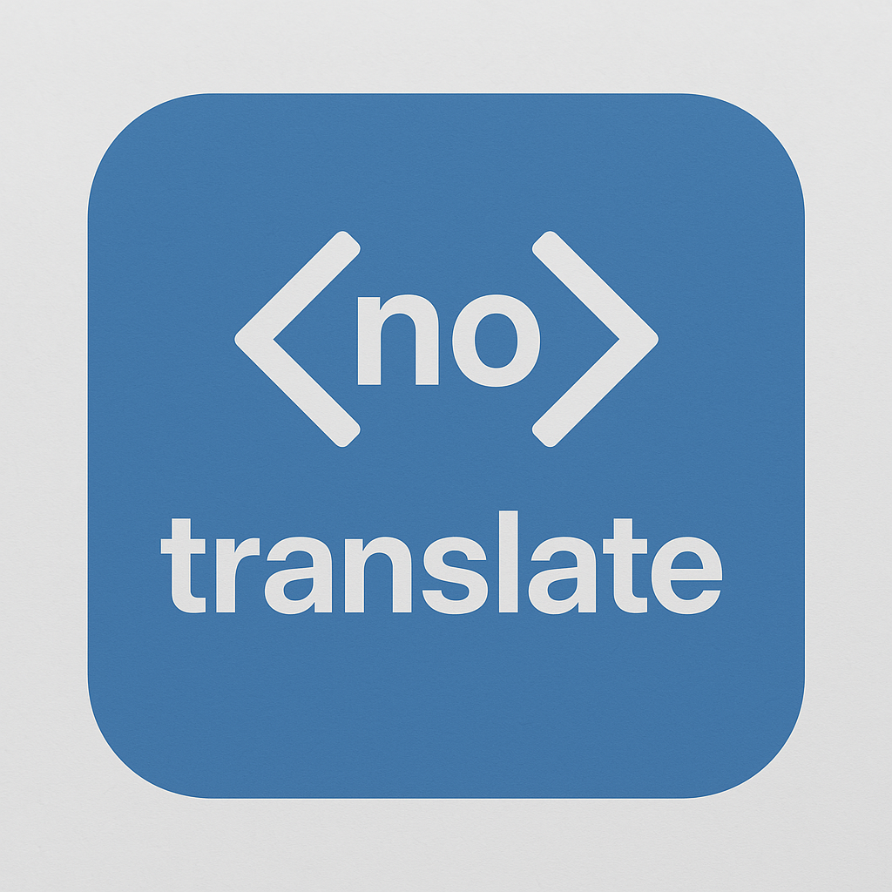

# Set Translate No Attribute

A Chrome extension that automatically sets the `translate="no"` attribute on `<code>` and `<pre>` elements to prevent automatic translation of code snippets.

## Features

- Automatically adds `translate="no"` to all `<code>` and `<pre>` tags on any webpage
- Works immediately upon page load
- Monitors DOM changes to apply the attribute to dynamically added elements
- Lightweight with minimal performance impact

## Why Use This Extension?

Code snippets and pre-formatted text often produce nonsensical results when translated by browser translation services. This extension ensures that code blocks remain in their original form, making technical documentation and programming tutorials more readable when the rest of the page is translated.

## Installation

### From Chrome Web Store (Coming Soon)

1. Visit the Chrome Web Store page for this extension
2. Click "Add to Chrome"
3. Confirm the installation

### Manual Installation (Developer Mode)

1. Clone this repository or download it as a ZIP file
2. Build the extension with `npm run build`
3. Open Chrome and navigate to `chrome://extensions/`
4. Enable "Developer mode" in the top-right corner
5. Click "Load unpacked" and select the extension directory
6. The extension is now installed and active

## Development

### Prerequisites

- Node.js and npm

### Setup

1. Clone this repository
2. Install dependencies:
